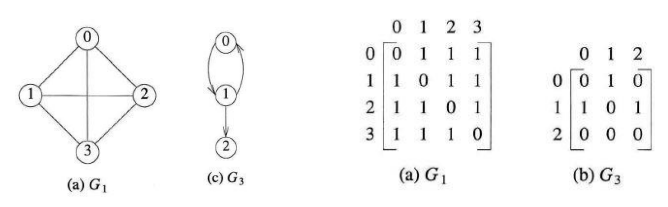
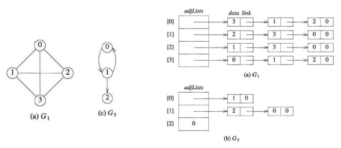

# 그래프(Graphs)

## 목차

- [그래프(Graphs)의 정의와 표현](#그래프graphs의-정의와-표현)
  - [인접 행렬(Adjacency Matrix)](#인접-행렬adjacency-matrix)
  - [인접 리스트(Adjacency List)](#인접-리스트adjacency-list)
- [그래프 탐색](#그래프-탐색)
  - [DFS(Depth-First Search)](#dfsdepth-first-search)
    - [실습 - DFS 구현하기](#실습---dfs-구현하기)
  - [BFS(Breadth-First Search)](#bfsbreadth-first-search)
    - [실습 - BFS 구현하기](#실습---bfs-구현하기)
- [최소 신장 트리(Minimum Spanning Trees)](#최소-신장-트리minimum-spanning-trees)
  - [신장 트리(Spanning Trees)란?](#신장-트리spanning-trees란)
  - [최소 신장 트리(Minimum Spanning Tree)란?](#최소-신장-트리minimum-spanning-tree란)
  - [Kruskal Algorithm](#kruskal-algorithm)
    - [실습 - Kruskal Algorithm 구현하기](#실습---kruskal-algorithm-구현하기)
  - [Prim Algorithm](#prim-algorithm)
    - [실습 - Prim Algorithm](#실습---prim-algorithm)

## 그래프(Graphs)의 정의와 표현

그래프(Graphs)는 정점(Vertex)과 정점을 연결하는 간선(Edge)의 집합으로 이루어진 비선형 자료구조이다.\
그래프는 객체 간의 다양한 연결 관계를 표현하는 데 적합하다.

G = (V, E)로 표현하며, V는 정점들의 집합, E는 간선들의 집합이다.\
방향이 없는 그래프인 경우 간선(u, v)와 간선(v, u)는 동일하다.\
방향이 있는 그래프인 경우 <u, v>에서 u가 시작점, v가 도착점으로 <v, u>와는 다르다.

간선에는 가중치가 존재할 수 있다. 방향 그래프인 경우 방향에 따라 가중치가 다를 수도 있다.\

정점에 연결되어 있는 간선의 개수를 차수(Degree)라고 한다. 방향 그래프에서는 진입 차수(In-degree)와 진출 차수(Out-degree)를 구분한다.

그래프에서 한 정점에서 다른 정점까지 간선을 따라 이동하는 것을 경로라고 한다. 모든 정점 사이에 경로가 존재하는 경우 연결 그래프(Connected Graph)라고 한다.

두 정점 사이에 직접 연결된 간선이 있다면 두 정점을 인접 정점(Adjacent Vertex)라고 한다. 

### 인접 행렬(Adjacency Matrix)

컴퓨터에서 그래프를 표현하는 대표적인 방법은 두 가지가 있다. 그 중 인접 행렬은 정점 간 연결 관계를 2차원 배열에 저장한다.



인접 행렬을 사용하면 두 정점이 연결되어 있는지 확인하기 쉽고 간선 존재 여부를 O(1)에 확인할 수 있다.\
하지만 정점이 많고 간선이 적은 희소 그래프에서는 공간 낭비가 크며 기본적으로 공간 복잡도가 O(V<sup>2</sup>)이다.

### 인접 리스트(Adjacency List)

인접 리스트는 각 정점에 연결된 정점들을 리스트로 저장한다.



인접 리스트를 사용하면 실제로 존재하는 간선만 저장하므로 희소 그래프에서 메모리 효율이 좋다. 또한 그래프 탐색에 적합하다.\
공간 복잡도는 일반적으로 O(V+E)이다.

## 그래프 탐색

그래프에서 모든 정점을 방문하는 대표적인 방법에는 두 가지가 있다. 연결 정보는 인접 리스트로 관리한다고 가정한다.

### DFS(Depth-First Search)

DFS는 깊이 우선 탐색으로 한 방향으로 최대한 깊게 탐색한 후 돌아온다.\
DFS는 일반적으로 스택 또는 재귀를 이용한다.

#### 실습 - DFS 구현하기

```c
void dfs(int v, graphpointer graph[])
{
	graphpointer w;
	visited[v] = TRUE;
	int br = 0;
	for (w = graph[v]; w; w = w->link)
	{
		if (w->vertex == -1 && w->link)
		{
			w = w->link;
		}
		else if (w->vertex == -1 && !w->link)
		{
			edges1[edge_count] = v;
			edges2[edge_count++] = -1;
			br = 1;
		}
		if (br == 0)
		{
			if (!visited[w->vertex])
			{
				edges1[edge_count] = v;
				edges2[edge_count++] = w->vertex;
				dfs(w->vertex, graph);
			}
		}
	}
}
```

### BFS(Breadth-First Search)

BFS는 너비 우선 탐색으로 가까운 정점부터 방문한다.\
BFS는 일반적으로 큐를 이용한다.

#### 실습 - BFS 구현하기

```c
void bfs(int v, graphpointer graph[])
{
	graphpointer w;
	front = rear = NULL;
	visited[v] = TRUE;
	addq(v);
	int br = 0;
	while (front)
	{
		v = deleteq();
		for (w = graph[v]; w; w = w->link)
		{
			if (w->vertex == -1 && w->link)
			{
				w = w->link;
			}
			else if (w->vertex == -1 && !w->link)
			{
				edges1[edge_count] = v;
				edges2[edge_count++] = -1;
				br = 1;
			}
			if (br == 0)
			{
				if (!visited[w->vertex])
				{
					edges1[edge_count] = v;
					edges2[edge_count++] = w->vertex;
					addq(w->vertex);
					visited[w->vertex] = TRUE;
				}
			}
		}
	}
}
```

## 최소 신장 트리(Minimum Spanning Trees)

### 신장 트리(Spanning Trees)란?

신장 트리(Spanning Trees)는 그래프의 모든 정점을 포함하면서 사이클이 없는 부분 그래프이다.\
연결 그래프에서 DFS 또는 BFS를 수행 시 탐색 트리를 만드는 경우 해당 트리 역시 신장 트리이다.

신장 트리는 다음 세 가지 조건을 만족해야 한다.

1. 원래 그래프의 모든 정점을 포함해야 한다.

2. 모든 정점이 연결되어 있어야 한다.

3. 사이클이 없어야 한다.

출반한 정점으로 다시 돌아오는 경로가 존재한다면 사이클(Cycle)이 있다고 한다. 신장 트리는 사이클이 존재해서는 안된다.

신장 트리의 중요한 특징은 정점이 n개인 신장 트리는 항상 (n - 1)개의 간선을 가진다. 모든 정점이 연결되어 있어야 하는데 사이클은 없어야 하므로 시작 정점에서 새로운 정점을 하나 연결할 때마다 간선을 무조건 하나만 사용해야 하기 때문이다.

하나의 그래프에는 여러 개의 신장 트리가 존재할 수 있다.

### 최소 신장 트리(Minimum Spanning Tree)란?

신장 트리를 가중치(Weight)가 있는 그래프에 적용하는 경우 전체 간선의 가중치 합이 가장 작은 신장 트리를 최소 신장 트리(Minimum Spanning Trees, MST)라고 한다.

즉, MST는 모든 정점을 연결하고 사이클이 없으면서 전체 비용이 최소인 트리이다.

### Kruskal Algorithm

최소 신장 트리를 구하는 대표적인 알고리즘 중 하나가 Kruskal Algorithm이다.\
Kruskal Algorithm은 간선을 가중치가 작은 순서대로 정렬한 다음 사이클을 만들지 않는 간선을 선택한다.

해당 알고리즘에서 사이클이 생성되는지 확인하는 데 Union-Find가 유용하게 사용된다.

#### 실습 - Kruskal Algorithm 구현하기

```c
void krus_al(graphpointer graph[], int mat_size, int coast_list[][10])
{
	while (edge_count != mat_size - 1)
	{
		int least_edge = 10000;
		int row = 0;
		int col = 0;
		for (int p = 0; p < mat_size; p++)
		{
			graphpointer node = graph[p];
			node = node->link;
			for (node; node != NULL; node = node->link)
			{
				if (node->weight < least_edge && coast_list[p][node->vertex] != -1)
				{
					least_edge = node->weight;
					row = p;
					col = node->vertex;
				}
			}
		}
		coast_list[row][col] = -1;
		coast_list[col][row] = -1;
		edges1[edge_count] = row;
		edges2[edge_count++] = col;
		if (edge_count == 1)
		{
			total_coast += least_edge;
		}
		else
		{
			if (!isCycle())
			{
				total_coast += least_edge;
			}
			else
			{
				edge_count--;
				edges1[edge_count] = -1;
				edges2[edge_count] = -1;
			}
		}
		int br = 0;
		int br_2 = 0;
		for (int k = 0; k < mat_size; k++)
		{
			for (int s = 0; s < mat_size; s++)
			{
				if (coast_list[k][s] == -1)
				{
					br = 1;
					br_2 = 1;
				}
				else if(coast_list[k][s] != -1)
				{
					br = 0;
					br_2 = 0;
					break;
				}
			}
			if (br_2 == 0)
			{
				break;
			}
		}
		if (br == 1)
		{
			break;
		}
	}
}

int isCycle()
{
	int* parent = (int*)malloc(10 * sizeof(int));
	for (int j = 0; j < 10; j++)
	{
		parent[j] = -1;
	}
	for (int i = 0; i < edge_count; ++i)
	{
		int x = find(parent, edges1[i]);
		int y = find(parent, edges2[i]);
		if (x == y && (x != -1 && y != -1))
			return 1;
		Union(parent, x, y);
	}
	return 0;
}

int find(int parent[], int i)
{
	if (parent[i] == -1)
		return i;
	return find(parent, parent[i]);
}

void Union(int parent[], int x, int y)
{
	parent[y] = x;
}
```

### Prim Algorithm

또 다른 알고리즘으로는 Prim Algorithm이 있다.\
Prim Algorithm은 하나의 정점에서 시작하여 현재 만들어진 트리와 연결되는 가장 작은 가중치의 간선을 계속 선택한다.

#### 실습 - Prim Algorithm

```c
void prim_al(graphpointer graph[], int mat_size, int coast_list[][10])
{
	total_edge[0] = 0;
	while (edge_count != mat_size - 1)
	{
		if (edge_count == 0)
		{
			int v = -1;
			int least_edge = 10000;
			graphpointer node = graph[0];
			node = node->link;
			for (node; node != NULL; node = node->link)
			{
				if (node->weight < least_edge)
				{
					least_edge = node->weight;
					v = node->vertex;
				}
			}
			total_coast += least_edge;
			coast_list[0][v] = -1;
			coast_list[v][0] = -1;
			total_edge[1] = v;
			edges1[edge_count] = 0;
			edges2[edge_count++] = v;
		}
		else
		{
			int v = -1;
			int u = -1;
			int least_edge = 10000;
			for (int i = 0; i <= edge_count; i++)
			{
				int k = total_edge[i];
				int br = 0;
				graphpointer node = graph[k];
				node = node->link;
				for (node; node != NULL; node = node->link)
				{
					for (int s = 0; s <= edge_count; s++)
					{
						if (node->vertex == total_edge[s])
						{
							br = 1;
							break;
						}
					}
					if (node->weight < least_edge && coast_list[k][node->vertex] != -1 && br == 0)
					{
						least_edge = node->weight;
						v = node->vertex;
						u = k;
					}
					br = 0;
				}
			}
			if (least_edge == 10000)
			{
				break;
			}
			total_coast += least_edge;
			coast_list[u][v] = -1;
			coast_list[v][u] = -1;
			edges1[edge_count] = u;
			edges2[edge_count++] = v;
			total_edge[edge_count] = v;
		}
	}
}
```
