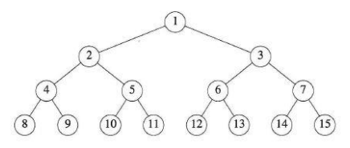
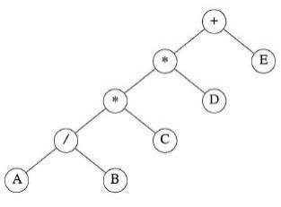

# 트리(Trees)

## 목차

## 트리(Tree)의 정의

트리는 다음 조건을 만족하는 하나 이상의 노드의 집합이다.

1. 루트(root)라고 불리는 특별한 노드가 하나 존재한다.

2. 나머지 노드들은 서로 겹치지 않는 n ≥ 0 개의 집합 T<sub>1</sub>, ..., T<sub>n</sub>으로 분할되며, 이들 각각의 집합은 트리이다. T<sub>1</sub>, ..., T<sub>n</sub>을 루트의 서브트리(subtree)라고 한다.

## 이진 트리(Binary Tree)

이진 트리(Binary Tree)는 비어 있거나, 하나의 루트와 서로 겹치지 않는 두개의 이진 트리인 왼쪽 서브트리와 오른쪽 서브트리로 구성된 유한한 노드의 집합이다.

이진 트리는 다음 두 성질을 갖고 있다.

1. 이진 트리에서 레벨 i에 존재할 수 있는 노드의 최대 개수는 2<sup>i-1</sup>이며, i≥1이다.

2. 깊이가 k인 이진 트리의 존재할 수 있는 노드의 최대 개수는 2<sup>k</sup>이며, k≥1이다.

따라서 깊이가 k인 완전 이진 트리는 2<sup>k</sup> - 1개의 노드를 가지며, k≥0이다.

\
깊이가 4인 완전 이진 트리

### 배열로 이진 트리 표현하기

배열로 완전 이진 트리를 표현하는 경우 어떠한 노드든 인덱스 i(1≤i≤n)에 대해 다음 조건들이 성립한다.

1. i가 1이 아니라면 그 노드의 부모의 인덱스는 i/2이다. 만약 i가 1이라면 그 노드는 루트이며 부모 노드가 없다.

2. 왼쪽 자식 노드의 인덱스는 2i이다. 만약 2i가 n보다 크다면 그 노드는 왼쪽 자식 노드가 없다.

3. 오른쪽 자식 노드의 인덱스는 2i+1이다. 만약 2i+1이 n보다 크다면 그 노드는 오른쪽 자식 노드가 없다.

### 연결 리스트로 이진 트리 표현하기

연결 리스트로 이진 트리를 표현하는 경우 왼쪽 자식 노드와 오른쪽 자식 노드를 가리키는 포인터로 쉽게 표현할 수 있다.

```c
struct node {
    int data;
    node* leftChild, rightChild;
}
```

### 이진 트리의 순회(Binary Tree Traversal)

이진 트리 순회는 이진 트리의 모든 노드를 일정한 규칙에 따라 한 번씩 방문하는 과정이다.

자식 노드를 방문하는 순서에 따라 여러 가지 순회 방법이 있으며 대표적으로 전위 순회, 중위 순회, 후위 순회가 있다. 이외에도 레벨 순회가 있다.

#### 전위 순회(Preorder)

전위 순회는 루트를 먼저 방문하고 왼쪽 자식 노드를 방문한 후 오른쪽 자식 노드를 방문한다.

즉, 현재 노드를 방문한 후 왼쪽 서브트리를 순회하고 오른쪽 서브트리를 순회한다.



위 트리를 기준으로 전위 순회하는 경우의 방문 순서는 다음과 같다.
> +**/ABCDE

전위 순회는 트리의 구조를 복하사거나 저장하는 경우 등에 활용할 수 있다.

#### 중위 순회(Inorder)

중위 순회는 왼쪽 자식 노드를 먼저 방문하고 루트를 방문한 후 오른쪽 자식 노드를 방문한다.

즉, 왼쪽 서브트리를 순회하고 현재 노드를 방문한 후 오른쪽 서브트리를 순회한다.

아까의 트리 이미지를 기준으로 중위 순회하는 경우의 방문 순서는 다음과 같다.
> A/B*C*D+E

이진 탐색 트리에서 중위 순회를 수행하면 데이터를 오름차순으로 얻을 수 있다.

#### 후위 순회(Postorder)

후위 순회는 왼쪽 자식 노드를 먼저 방문하고 오른쪽 자식 노드를 방문한 후 루트를 방문한다.

즉, 왼쪽 서브트리를 순회하고, 오른쪽 서브트리를 순회한 후 현재 노드를 방문한다.

아까의 트리 이미지를 기준으로 후위 순회하는 경우의 방문 순서는 다음과 같다.
> AB/C*D*E+

후위 순회는 자식 노드를 먼저 처리한 후 부모 노드를 처리해야 하는 경우에 적합하다. 따라서 트리를 삭제할 때 자식 노드를 먼저 삭제해야 한다면 후위 순회를 활용할 수 있다.

#### 레벨 순회(Level-order)

레벨 순회는 깊이가 같은 노드들을 위에서부터 차례대로 방문한다.

아까의 트리 이미지를 기준으로 레벨 순회하는 경우의 방문 순서는 다음과 같다.
> +*E*D/CAB

레벨 순회는 일반적으로 큐를 사용하여 구현한다.\
그래프에서의 BFS와 유사하다.

#### 실습 - 순회 구현하기

전위, 중위, 후위 순회는 재귀적으로 구현하기 쉽다.

```c
typedef struct ListNode* ListPointer;
typedef struct ListNode {
	ListPointer lchild;
	char data;
	ListPointer rchild;
} ListNode;

void inorder(ListPointer head)
{
	if (head)
	{
		inorder(head->lchild);
		printf("%c", head->data);
		inorder(head->rchild);
	}
}

void preorder(ListPointer head)
{
	if (head)
	{
		printf("%c", head->data);
		preorder(head->lchild);
		preorder(head->rchild);
	}
}

void postorder(ListPointer head)
{
	if (head)
	{
		postorder(head->lchild);
		postorder(head->rchild);
		printf("%c", head->data);
	}
}
```

실질적인 세 함수의 차이는 현재 노드를 출력하는 위치뿐이다.

각각의 순회를 반복문으로 구현하는 것 또한 가능하다. 이 경우 스택을 사용하여 이전에 방문했던 부모 노드로 돌아갈 수 있게 해야 한다.

### 스레드 이진 트리(Threaded Binary Tree)

스레드 이진 트리는 이진 트리에서 사용되지 않는 NULL 포인터를 활용하여 다른 노드를 가리키는 링크(Thread)로 사용하는 이진 트리이다.

일반적인 이진 트리는 각 노드가 왼쪽 자식 노드, 오른쪽 자식 노드를 가리키는 두 개의 포인터를 가지며 자식이 없는 경우 해당 포인터가 nullptr이 된다.\
이러한 NULL 포인터를 그냥 버리지 않고 순회에 사용할 수 있는 링크로 활용하는 것이 스레드 이진 트리의 핵심이다.

스레드 이진 트리를 이용하면 스택이나 재귀 없이 중위 순회를 수행할 수 있다.

대표적으로 중위 순회에서 다음에 방문할 노드를 가리키는 방식과 이전에 방문한 노드를 가리키는 방식이 있다.\
이 때 포인터가 가리키는 것이 실제 자식 노드인지 아니면 스레드인지를 구분하기 위해 추가적인 플래그를 사용한다.

```c
struct Node
{
    int data;

    Node* left;
    Node* right;

    bool leftThread;
    bool rightThread;
};
```

스레드 이진 트리는 스택 없이 순회가 가능하고 NULL 포인터를 활용할 수 있다는 장점이 있지만, 트리의 삽입과 삭제가 복잡해져서 구현이 복잡하다는 단점이 있다.

### 힙(Heaps)

힙은 우선순위가 높은 원소를 빠르게 찾고 삭제하기 위해 사용하는 완전 이진 트리 기반의 자료구조이다.\
주로 우선순위 큐(Priority Queue)를 구현하는 데 사용된다.

#### 힙의 특징

1. 힙은 반드시 완전 이진 트리의 형태를 유지한다.\
완전 이진 트리이므로 배열로 효율적으로 표현할 수 있다.

2. 힙에서는 부모 노드와 자식 노드 사이의 우선순위 관계가 유지되어야 한다.\
최대 힙(Max Heap)의 경우 부모 노드의 값이 자식 노드보다 크거나 같은 형태이므로 항상 루트에 가장 큰 값이 존재한다.\
최소 힙(Min Heap)의 경우 부모 노드의 값이 자식 노드보다 작거나 같은 형태이므로 항상 루트에 가장 작은 값이 존재한다.

3. 힙에 새로운 원소를 삽입할 때는 가장 마지막 위치에 삽입한 후 힙 조건을 위반한다면 부모 노드와 자리를 바꾼다. 이를 힙 조건을 만족할 때 까지 반복한다. 시간 복잡도는 트리의 높이에 비례하므로 O(log n)이다.

4. 힙에서 노드를 삭제할 때는 루트 노드를 삭제한 후 마지막 노드를 루트로 이동시킨다. 그 후 힙 조건을 위반한다면 자식 노드와 자리를 바꾼다. 이를 힙 조건을 만족할 때 까지 반복한다. 삭제 역시 O(log n)이다.

#### 실습 - 힙 정렬(Heap Sort) 구현

최대 힙을 만든 다음 루트의 최댓값을 배열의 뒤쪽으로 보내고 힙 크기를 줄이는 과정을 반복하면 오름차순 정렬을 할 수 있다.

```c
void heapsort(int* heap, int n)
{
	int i, j, temp = 0;
	for (i = n / 2; i > 0; i--)
	{
		adjust(heap, i, n);
	}
	for (i = n - 1; i > 0; i--)
	{
		swap(&heap[1], &heap[i + 1], temp);
		adjust(heap, 1, i);
	}
}

void adjust(int* heap, int root, int n)
{
	int child, rootkey, temp;
	temp = heap[root];
	rootkey = heap[root];
	child = 2 * root;
	while (child <= n)
	{
		if ((child < n) && (heap[child] < heap[child + 1]))
		{
			child++;
		}
		if (rootkey > heap[child])
		{
			break;
		}
		else
		{
			heap[child / 2] = heap[child];
			child *= 2;
		}
	}
	heap[child / 2] = temp;
}

void swap(int* a, int* b, int temp)
{
	temp = *a;
	*a = *b;
	*b = temp;
}
```

### 이진 탐색 트리(Binary Search Trees, BST)

