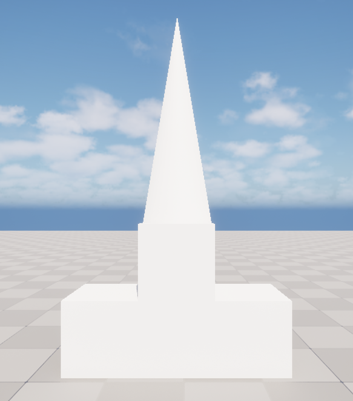
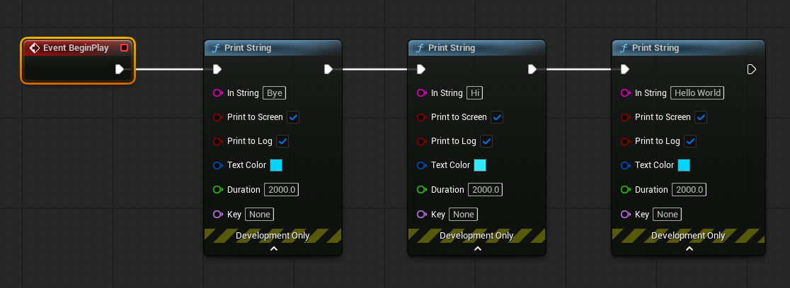
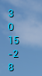
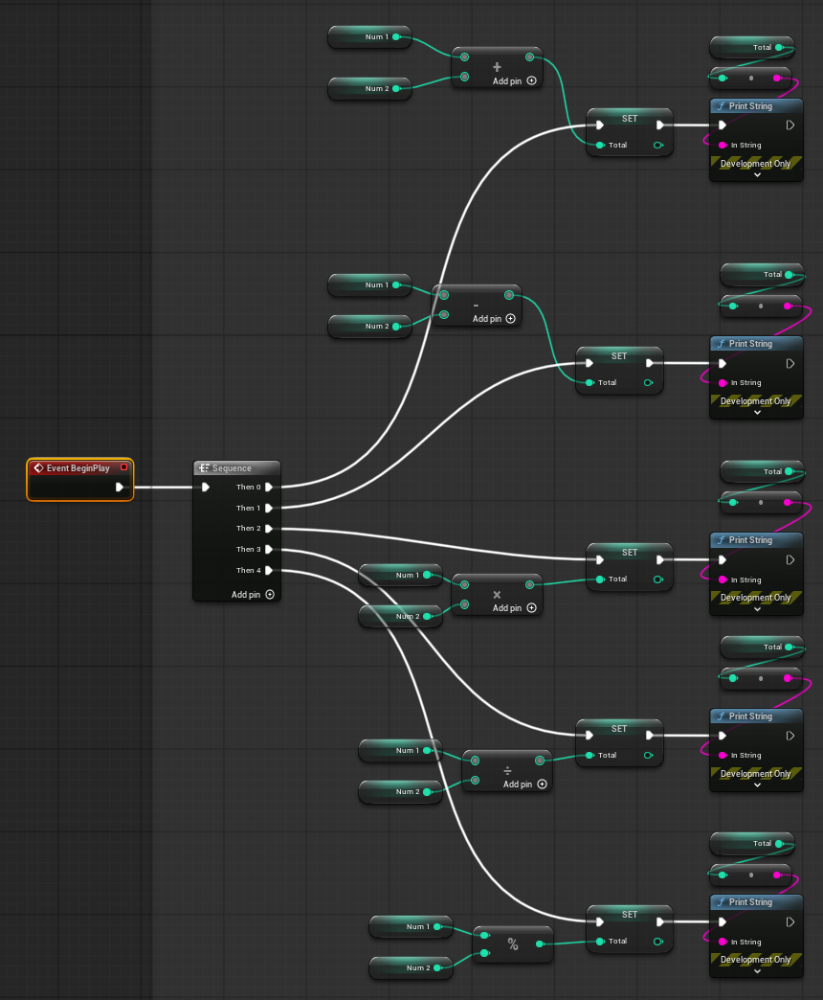
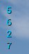
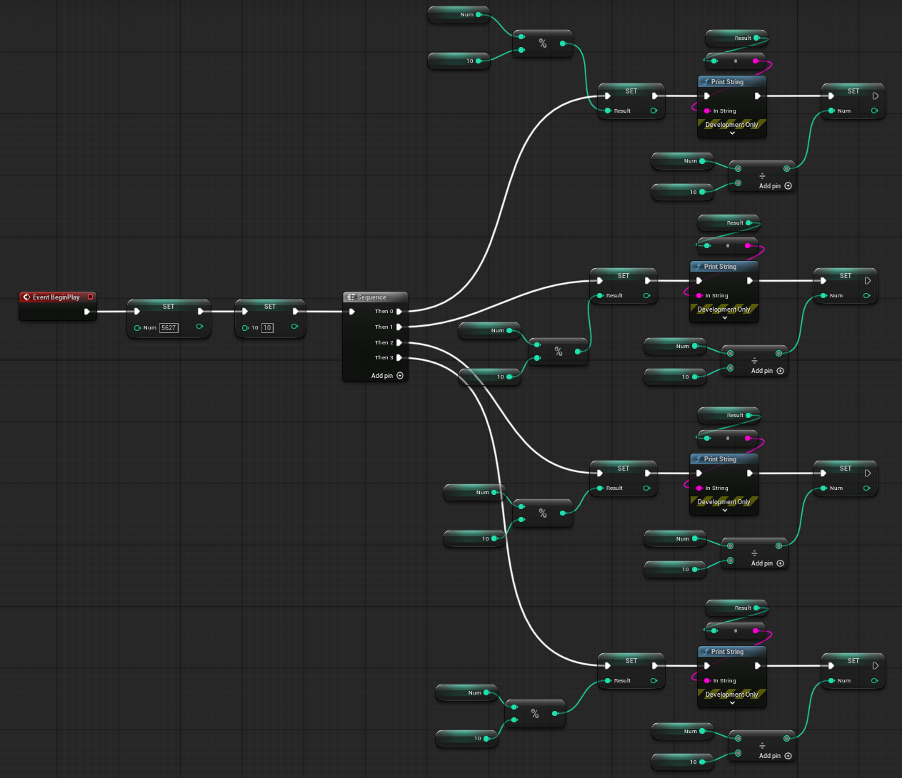

# 에디터 기초 - 2026.08.02

## 목차

- [언리얼 에디터 단축키](#언리얼-에디터-단축키)
  - [블루프린트 편집](#블루프린트-편집)
- [실습: StaticMeshActor 배치하기](#실습-staticmeshactor-배치하기)
- [실습: 화면에 글자 출력하기](#실습-화면에-글자-출력하기)
- [변수와 데이터 타입](#변수와-데이터-타입)
- [[실습] 연산자 적용하기](#실습-연산자-적용하기)
- [[실습] 연산자 활용](#실습-연산자-활용)

## 언리얼 에디터 단축키

- 이름변경: F2
- 액터의이름변경: F2
- 액터의 변경: QWER
- 편집카메라 이동: 마우스(우) 클릭 + WASD 
- 편집카메라 회전: 마우스 클릭 + 마우스 회전
- 선택한 액터Focus: 액터 선택 후 + F, 더블클릭
- 선택한 액터 표면에 붙이기: 액터 선택 후 + End키
- 편집카메라 액터와 동시이동: 액터 선택 후 + Shift
- 모두저장: CTRL+SHIFT+S
- 에디터 Play: ALT + P
- 에디터 멈추기: Esc
- 액터 복사: CTRL + D (CTRL + C > CTRL + V)

### 블루프린트 편집

- 줌인아웃: 마우스 휠
- 최대 줌인아웃: CRTL + 마우스 휠
- 노드끄기: ALT+ 노드 클릭
- 노드 중간 연결: CTRL + 노드 클릭
- 컴파일: F7
- 변수사용: 
- Get: CTRL + 변수 꺼내기
- Set:  ALT + 변수 꺼내기
- 복사: Ctrl + C
- 붙여넣기: Ctrl + V
- 복제: Ctrl + D
- 주석: C

## [실습] StaticMeshActor 배치하기

## [실습] 화면에 글자 출력하기

- Hello World
- Hi
- Bye

---
출력 결과

---
블루프린트

## 변수와 데이터 타입

언리얼 엔진의 블루프린트에서 변수(Variable)는 데이터를 저장하기 위한 공간이며, 각 변수는 데이터 타입(Data Type)을 가진다.

변수는 값을 저장하고, 블루프린트 로직에서 사용할 수 있는 데이터이다.

블루프린트 변수는 접근 범위를 설정할 수 있다. Private로 설정 시 현재 블루프린트 내부에서만 사용가능하고, Public으로 설정 시 다른 블루프린트에서 접근 가능하다.

블루프린트의 데이터 타입은 크게 기본 타입, 객체 타입, 구조체 타입으로 나뉜다.

1. Boolean(bool): 참/거짓 값을 저장한다. 조건문에서 많이 사용된다.

2. Integer(int): 정수 값을 저장한다.

3. Float: 실수 값을 저장한다. 위치, 속도 계산 등에 많이 사용된다.

4. String: 문자열 데이터를 저장한다.

5. Name(FName): 문자열과 비슷하지만 언리얼에서 이름 관리용으로 최적화된 타입이다.

6. Text(FText): 화면에 표시되는 텍스트용 타입이다.

7. Vector: 3차원 좌표 데이터를 저장한다. 언리얼에서 가장 많이 사용하는 타입 중 하나이다.

8. Rotator: 회전 값을 저장한다.

9. Transform: 위치, 회전, 크기를 모두 저장한다. 액터 배치나 이동에서 많이 사용된다.

10. Object Reference: 다른 객체를 참조하는 변수이다.

11. Class Reference: 클래스 자체를 저장하는 변수이다.

12. Array(배열): 같은 타입의 여러 데이터를 저장한다.

13. Enum(열거형): 미리 정의한 상태 값을 저장한다.

## [실습] 연산자 적용하기

출력 결과

---
블루프린트

## [실습] 연산자 활용

- 주어진 숫자에 자리 수를 출력하기
- 5627

    5\
    6\
    2\
    7

---
출력 결과

---
블루프린트

