# 블루프린트 기초1 - 2026.08.09

## 목차

- [분기문](#분기문)
  - [비교연산자](#비교연산자)
- [반복문](#반복문)
  - [For Loop](#for-loop)
  - [While Loop](#while-loop)
- [실습](#실습)
  - [[실습] 0~10 총합 구하기(whileloop로 구현)](#실습-010-총합-구하기whileloop로-구현)
  - [[실습] 0~10의 수중에 짝수만 출력하기(whileloop로 구현)](#실습-010의-수중에-짝수만-출력하기whileloop로-구현)
  - [[실습] 반복문, 분기문 통합](#실습-반복문-분기문-통합)
  - [[실습] 연산자 활용](#실습-연산자-활용)

## 분기문

분기문(Branch)은 특정 조건을 검사하여 조건이 참인지 거짓인지에 따라 실행 흐름을 나누는 것이다. C++의 if문과 같은 역할을 한다.

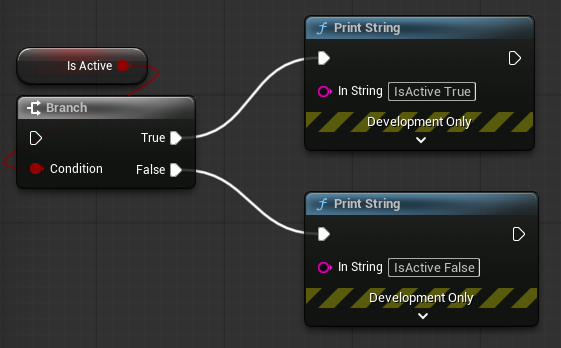

조건이 참일 경우 True를 거짓일 경우 False를 실행한다.\
Condition에는 반드시 Boolean값이 들어간다.

### 비교연산자

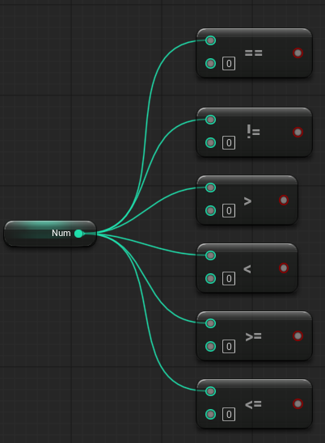

이러한 비교연산자들로 생성된 Boolean 조건을 분기문에 전달할 수 있다.

---
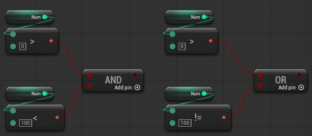

두 Boolean 값을 비교하는 AND 혹은 OR 노드도 있다.

## 반복문

반복문은 특정 작업을 여러 번 실행할 때 사용한다.

### For Loop

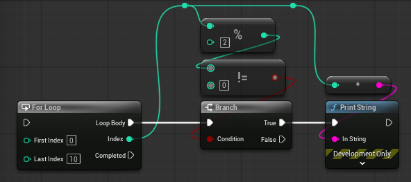

블루프린트의 For Loop는 C++의 for문과 대응된다.\
First Index는 반복 시작 값이고 Last Index는 반복 마지막 값이다.\
Loop Body는 매 반복마다 실행되며, 반복이 모두 끝나면 Completed 노드를 한 번 실행한다.

Index는 현재 몇 번째 반복인지를 나타내는 값이다. 따라서 For Loop는 반복 횟수가 정해져 있을 때 사용하기 편하다.

### While Loop

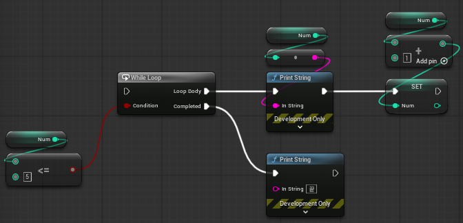

While Loop는 조건이 참인 동안 계속 반복한다.\
For Loop와 마찬가지로 Loop Body는 매 반복마다 실행되며, 반복이 모두 끝나면 Completed 노드를 한 번 실행한다.

조건이 만족되는 동안 반복이 필요한 경우 While Loop를 사용하기 편하다.

## 실습

### [실습] 0~10 총합 구하기(whileloop로 구현)

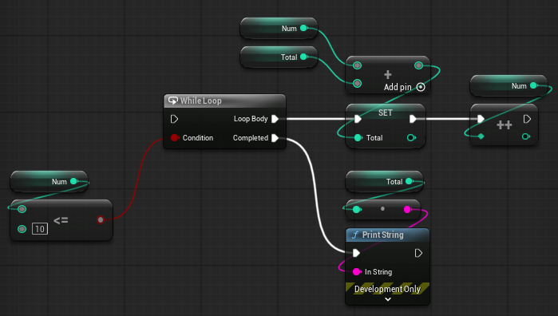

### [실습] 0~10의 수중에 짝수만 출력하기(whileloop로 구현)

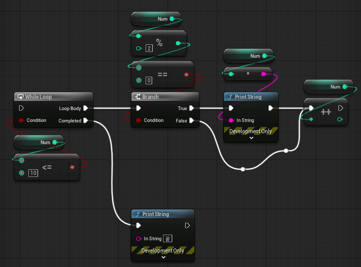

### [실습] 반복문, 분기문 통합

- 1 ~ 100 까지 숫자를
    - 1, 3, ..., 99\
    2, 4, 6, ..., 100
- 2번 나누어서 출력

---
1. 1 ~ 100까지 반복

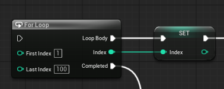

2. 짝수, 홀수 분리

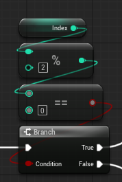

3. 분리된 데이터를 2개의 텍스트에 누적 저장

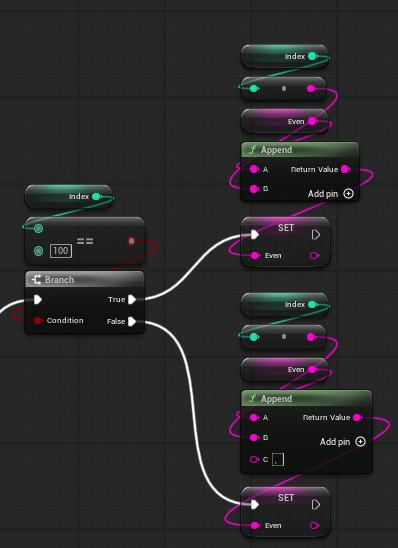

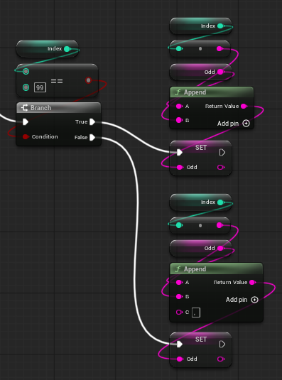

4. 2개의 텍스트를 화면에 출력

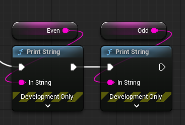

### [실습] 연산자 활용

- 주어진 숫자의 자리 수를 출력하기
    - 5678\
    5\
    6\
    7\
    8
    - 확장 > 자리 수가 다른 숫자도 동일한 처리가 가능해야 함.
        - whileloop를 이용해서 반복이 가변적인 경우 사용

---
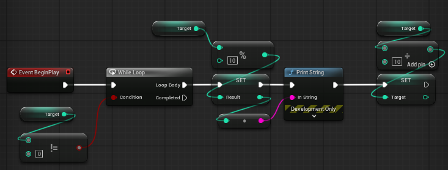
