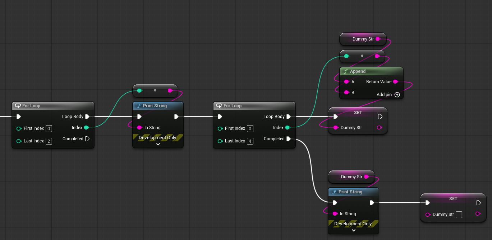
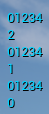
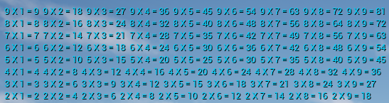
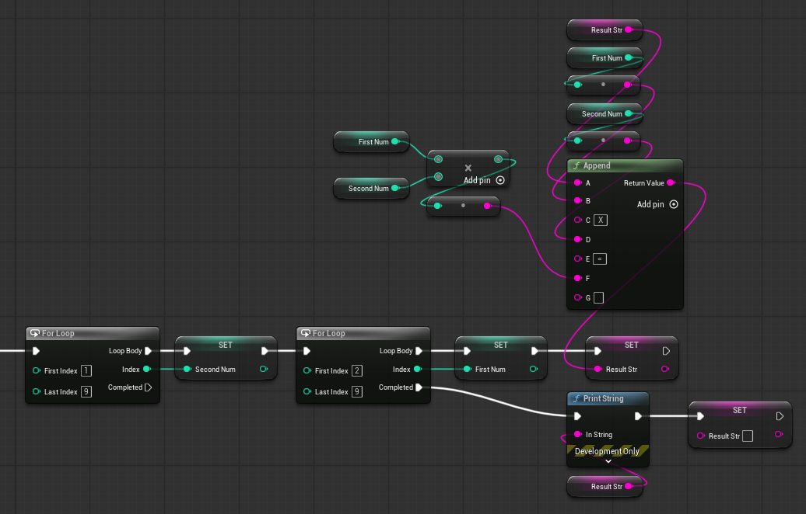
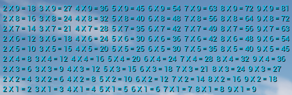
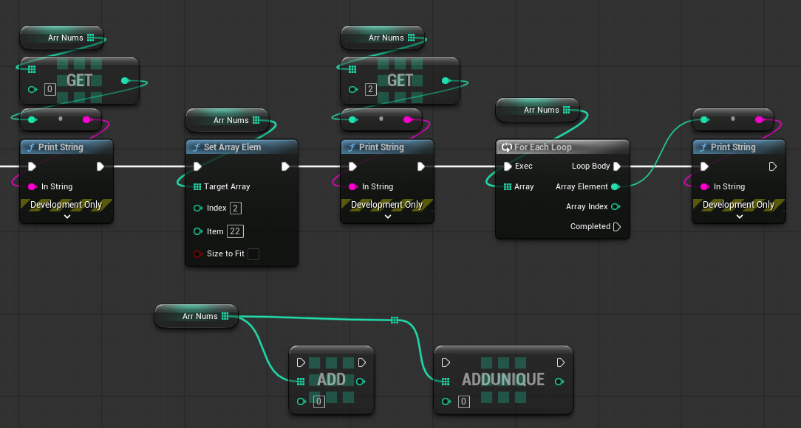
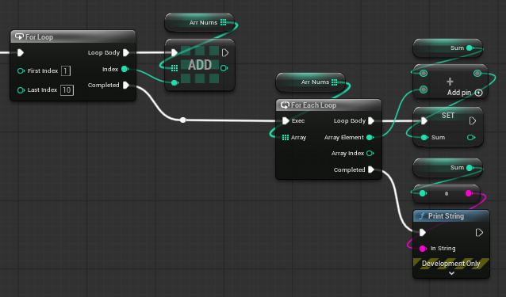
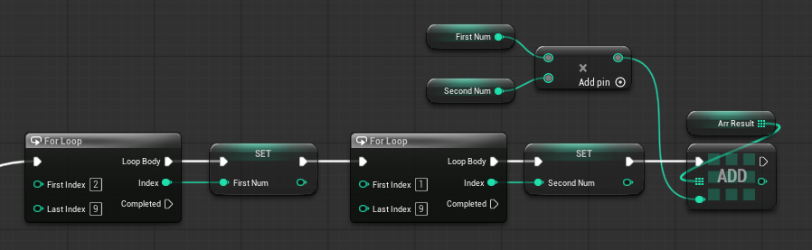
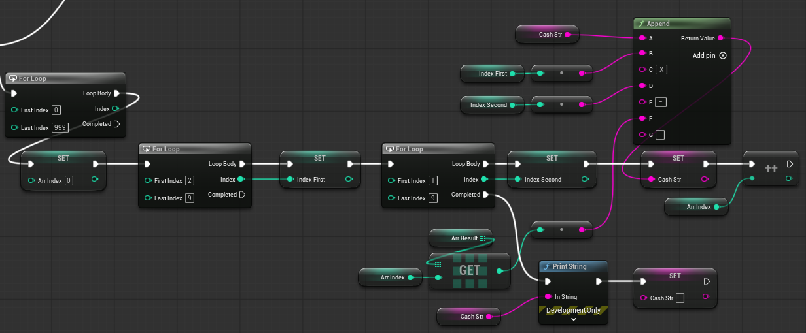
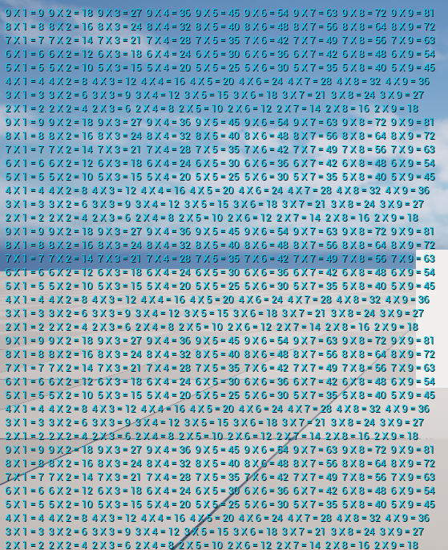

# 블루프린트 기초2 - 2026.08.16

## 목차

- [반복문 중첩](#반복문-중첩)
  - [[실습] 구구단 출력(가로)](#실습-구구단-출력가로)
  - [[실습] 구구단 출력(세로)](#실습-구구단-출력세로)
- [배열](#배열)
  - [For Each Loop](#for-each-loop)
  - [[실습] 배열데이터 합산](#실습-배열데이터-합산)
  - [[실습] 배열 캐싱 처리](#실습-배열-캐싱-처리)

## 반복문 중첩

반복문 중첩은 반복문 안에 또 다른 반복문을 넣는 것이다.\
외부 반복문의 한 번의 실행마다 내부 반복문 전체가 실행된다.

---
반복문 중첩 블루프린트

---
출력 결과

### [실습] 구구단 출력(가로)

---
블루프린트

---
출력 결과

### [실습] 구구단 출력(세로)

---
블루프린트

---
출력 결과

## 배열

배열(Array)은 여러 개의 데이터를 하나의 변수에 저장하고 관리하는 자료구조이다.\
블루프린트에서 변수의 타입을 설정할 때 변수 타입 오른쪽의 컨테이너 설정을 Array로 변경하면 배열 변수가 된다.

배열의 Index는 0부터 시작하며 Get 노드를 사용하여 특정 Index의 값을 가져올 수 있다.

배열에 새로운 요소를 추가할 때는 Add를 사용한다. Add Unique는 배열에 해당 값이 이미 존재하는지 검사한 후 추가한다.

Insert는 특정 Index에 값을 삽입한다.

특정 값을 배열에서 제거할 때는 Remove Item을 사용한다. Remove Item은 값을 기준으로 제거한다.\
특정 Index의 요소를 제거할 때는 Remove Index를 사용한다. 

배열에 현재 몇 개의 요소가 들어있는지 확인할 때 Length를 사용한다.

배열에 특정 값이 존재하는지 검사할 때는 Contains를 사용한다.

특정 값이 배열의 몇 번째 Index에 있는지 찾을 때 Find를 사용한다. 값이 존재하지 않는 경우에는 유효하지 않은 Index가 반환된다.

### For Each Loop

배열의 모든 요소를 하나씩 처리할 때 사용하는 반복문이다.

---
블루프린트

### [실습] 배열데이터 합산

1. 배열 10개의 공간에 1 ~ 10까지 초기화
2. (배열값) 1 ~ 10까지 총합을 구하라
3. 결과 출력

---
블루프린트

---
출력 결과

   

### [실습] 배열 캐싱 처리

1. 구구단 결과값을 모두 캐싱한다. (72개의 데이터가 저장)
2. 저장된 데이터를 실제 값으로 출력한다. (단, 출력에서 어떤 산술연산도 사용않는다.)

[출력]
- 2단 ~ 9단 > 1000번 출력

---
블루프린트

1. Sequence0 배열 캐싱

    

2. Sequence1 캐싱된 배열 출력

    

---
출력 결과

