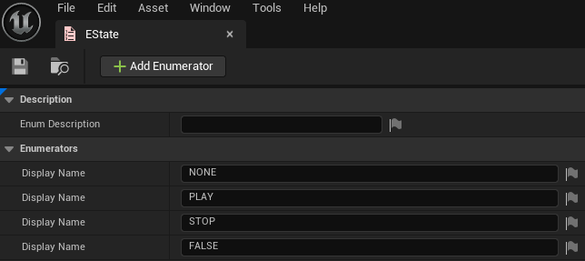
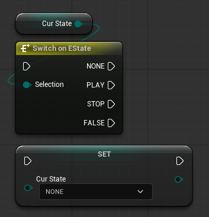
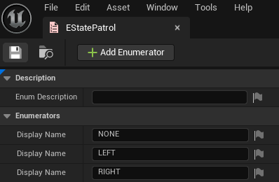
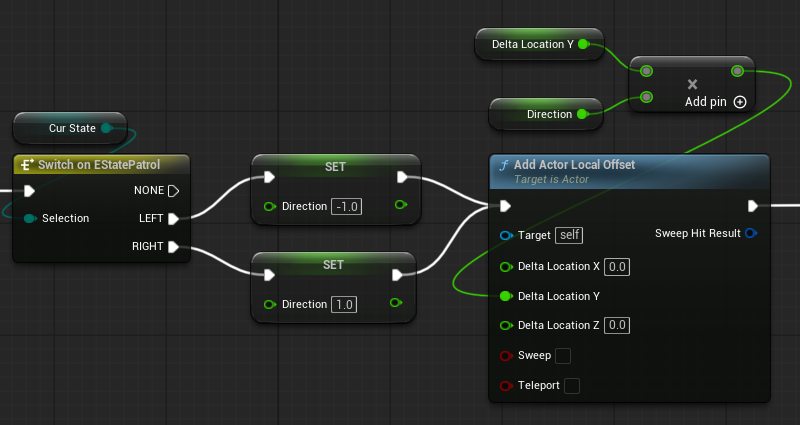
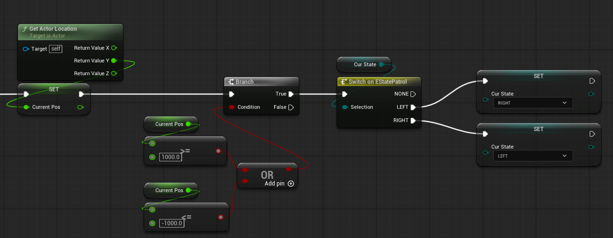
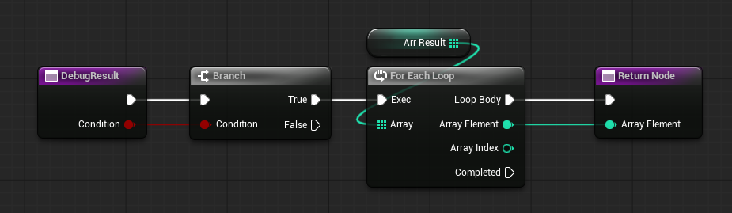

# 블루프린트 기초3 - 2026.08.23

## 목차

- [enum(열거형)](#enum열거형)
- [블루프린트 클래스(Blueprint Class)](#블루프린트-클래스blueprint-class)
  - [[실습] BP_Patrol 블루프린트 클래스 만들기](#실습-bp_patrol-블루프린트-클래스-만들기)
- [함수(Function)](#함수function)
  - [파라미터 vs 아규먼트](#파라미터-vs-아규먼트)

## enum(열거형)

Enum(열거형)은 미리 정의된 여러 개의 상태나 선택지를 하나의 타입으로 묶어서 관리하는 자료형이다.

---
Enum 생성

위와 같이 Enum을 생성한 후 블루프린트에서 변수의 자료형을 생성한 EState로 바꾸면 사용 가능하다.

Enum을 사용하는 가장 큰 이유는 상태를 명확하게 표현하고 관리하기 위해서이다. 숫자로 상태를 표현하는 것보다 Enum을 사용하면 상태의 의미를 명확하게 알 수 있다.\
또한 정의된 값만 사용할 수 있으므로 안전성을 보장할 수 있다.

블루프린트에서 Enum은 'Switch on Enum'과 함께 사용하는 경우가 많다.

Switch를 통해 각각의 상태에 맞는 로직을 실행할 수 있다.\

## 블루프린트 클래스(Blueprint Class)

블루프린트 클래스(Blueprint Class)는 언리얼 엔진에서 제공하는 비주얼 스크립팅 기반의 클래스이다.

블루프린트 클래스는 반드시 부모 클래스(Parent Class)를 가진다. 이러한 구조를 상속(Inheritance)이라고 하며, 부모 클래스에 따라 사용할 수 있는 기능과 이벤트가 달라진다.

블루프린트 클래스를 열면 여러 요소가 있다.\
Viewport에서는 블루프린트 클래스의 컴포넌트와 외형을 구성한다.\
Components에서는 블루프린트 클래스에 여러 Component를 추가할 수 있다.\
Construction Script는 액터가 생성되거나 에디터에서 변경될 때 실행되는 로직을 작성하는 곳이다.\
Event Graph는 블루프린트의 실제 게임 로직을 작성하는 공간이다.\
Variables는 변수를 만들거나 혹은 만들어진 변수를 볼 수 있다.

### [실습] BP_Patrol 블루프린트 클래스 만들기

- 기능: 좌우(-1000, 1000) 사이를 순찰하는 큐브
- 추가: Enum과 Switch를 활용

---
EStatePatrol

---
BP_Patrol

## 함수(Function)

함수(Function)는 특정 기능을 하나의 단위로 묶어두고, 필요할 때 호출하여 실행할 수 있도록 만든 것이다.

함수를 사용하면 반복적으로 사용되는 로직을 하나의 기능으로 묶을 수 있다.

함수는 외부에서 입력값을 전달받을 수 있다. 이러한 입력값을 파라미터(매개변수)라고 한다.\
또한 결과를 반환할 수도 있다. 이를 값을 리턴(return)한다고 한다.

위 함수는 입출력이 동시에 존재한다. 하지만 함수는 return을 하면 종료되기 때문에 For Each Loop를 전부 수행하지 않고 첫 번째로 값을 return하는 순간 함수가 종료된다.

### 파라미터 vs 아규먼트

- 파라미터: 파라미터는 함수 선언 시 정의되는 변수이다. 예를 들어, 함수 정의에서 사용하는 변수들이다.
- 아규먼트: 아규먼트는 실제 함수 호출 시 전달되는 값이다. 즉, 함수가 호출될 때 넘겨주는 실제 데이터이다.
