# 블루프린트 기초4 - 26.08.30.

## 목차

- [블루프린트 통신](#블루프린트-통신)
  - [LevelBlueprint로부터 BlueprintClass 통신](#levelblueprint로부터-blueprintclass-통신)
  - [BlueprintClass와 BlueprintClass 통신](#blueprintclass와-blueprintclass-통신)
    - [[실습] BP_Patrol과 BP_Cube의 통신](#실습-bp_patrol과-bp_cube의-통신)
  - [BlueprintClass로부터 LevelBlueprint 통신](#blueprintclass로부터-levelblueprint-통신)
- [Trigger 이벤트](#trigger-이벤트)
- [[실습] 통신의 모든 것](#실습-통신의-모든-것)

## 블루프린트 통신

블루프린트 통신은 서로 다른 블루프린트 객체가 서로의 변수나 함수를 사용하고 데이터를 전달하는 방법을 의미한다.\
블루프린트 통신을 사용하면 서로 다른 객체의 기능이나 데이터를 연결할 수 있다.

블루프린트 통신에는 크게 세 가지가 있으며 가장 적합한 방식을 선택하여 사용하면 된다.

1. LevelBlueprint -> BlueprintClass 통신

2. BlueprintClass <-> BlueprintClass 통신

3. BlueprintClass -> LevelBlueprint 통신

### LevelBlueprint로부터 BlueprintClass 통신

레벨 블루프린트와 블루프린트 클래스 사이의 통신은 레벨에 배치된 특정 액터를 제어하거나, 레벨의 이벤트를 블루프린트 클래스에 전달할 때 사용한다.\
레벨 블루프린트에서 블루프린트 클래스의 인스턴스에 대한 참조(Reference)를 얻은 뒤 통신한다.

---
BP_Cube 우측 이동 -> y위치 500이상인 경우 멈춤

- 레벨 블루프린트에서 통신을 위한 액터의 레퍼런스 준비(BP_Cube의 레퍼런스 참조)\
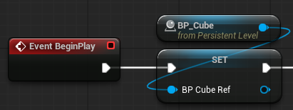

- BP_Cube에서 통신을 위한 커스텀 이벤트 준비(CE_Stop)\
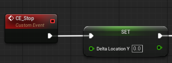

- 레벨 블루프린트에서 BP_Cube의 위치를 체크 -> 조건이 맞다면 통신을 이용해서 멈춤\
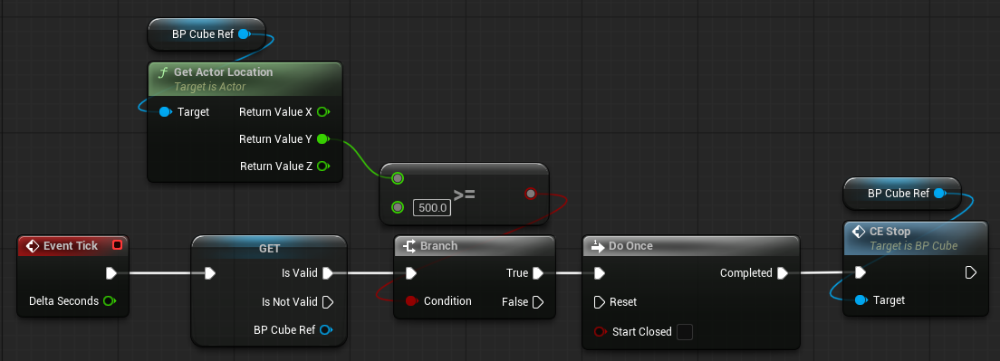

### BlueprintClass와 BlueprintClass 통신

블루프린트 클래스 간 통신은 서로 다른 블루프린트 객체가 변수나 함수를 주고받거나 이벤트를 전달하는 것을 의미한다.

---
BP_Cube 우측 이동 -> 멈춤 -> 다른 블루프린트 클래스의 방향을 반대로 함(BP_Cube2, BP_Cube3)

- 통신을 위한 레퍼런스 준비 -> 변수 인스턴스의 기능을 이용\
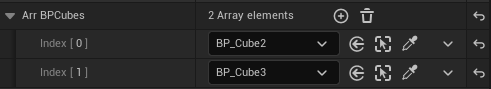

- BP_Cube에 통신을 위한 커스텀 이벤트 추가(CE_Reverse)\
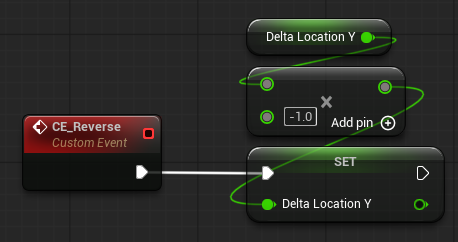

- BP_Cube가 멈춘 이후 다른 블루프린트 클래스와 통신\
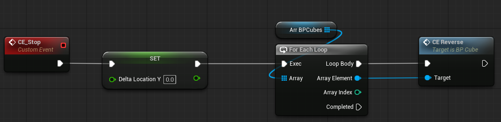

#### [실습] BP_Patrol과 BP_Cube의 통신

- 기능: BP_Patrol이 Turn 하는 시점을 체크 -> 2번째 Turn일때 BP_Cube를 모두 멈춘다.

---
- BP_Patrol에 BP_Cube들의 레퍼런스 등록
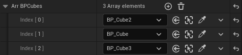

- Trun Count가 2가 되면 BP_Cube들의 CE_Stop 호출
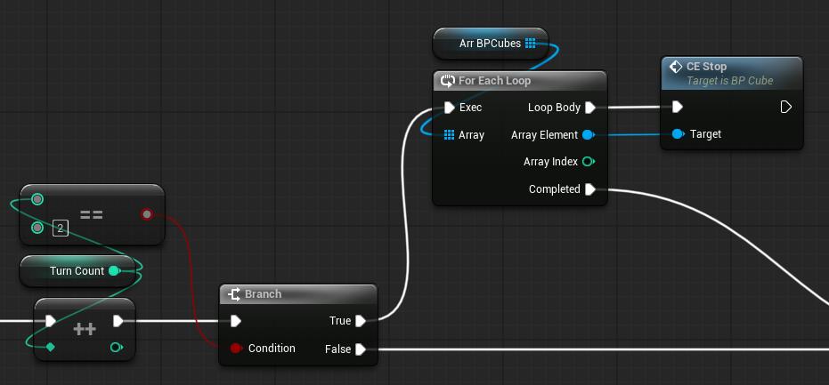

### BlueprintClass로부터 LevelBlueprint 통신

블루프린트 클래스 -> 레벨 블루프린트 통신은 레벨에 배치된 블루프린트 클래스의 인스턴스에서 발생한 정보를 레벨 블루프린트로 전달하거나, 레벨 블루프린트가 그 이벤트에 반응하도록 만드는 것이다.

- 함수호출의 2가지 방식
    - Pull 방식(직접) 호출: 직접 호출하는 class의 함수를 가져오는 방식
        - 문제점: 호출을 위한 클래스와 커플링(상호참조)되는 문제점이 있다.
    - Push 방식 호출: 주체되는 액터에 필요한 모든 함수를 넣어둔다.
        - 장점: 커플링을 줄이고, 동시에 필요한 기능을 처리가능하며, 코드가 깔끔하고 확장이 쉽다.
        - 문제점: 코드 분석이 어려워진다.

---
BP_Patrol이 Turn을 4번 하는 경우 -> 레벨 블루프린트 통신을 통해 모든 BP_Cube를 움직이도록 함

- 이벤트 디스패처 생성 -> 이벤트 디스패처 호출 -> 생성된 이벤트 디스패처에 바인딩 처리\
\
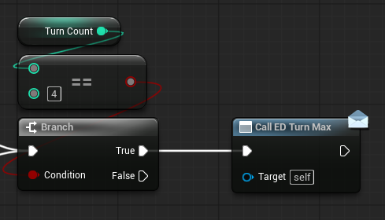

- 이벤트 바인딩(구독)\
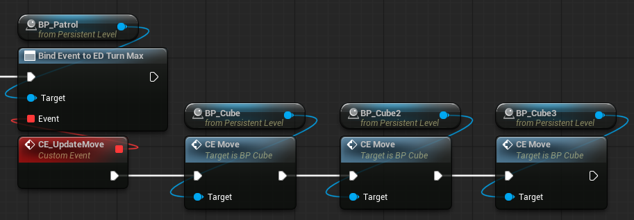

이벤트 디스패처도 파라미터(입력값)을 받아 처리할 수 있다.

### Trigger 이벤트

Trigger 이벤트는 특정 조건이나 상황이 발생했을 때 블루프린트의 로직을 실행시키는 이벤트이다.\
일반적으로 어떤 조건이 발생했는지를 감지하는 장치이다.

Trigger Volume을 레벨에 배치하면 특정 영역을 지정할 수 있다.

- OnActor XXX Overlap
    - Begin: 1회 진입시 호출
    - End: 1회 진출시 호출
    - Hit: 진입이후에 호출

### [실습] 통신의 모든 것

- 레벨 이름: Level_Demo
- 블루프린트 클래스(BP_Sphere, BP_PIN)
- TriggerBox

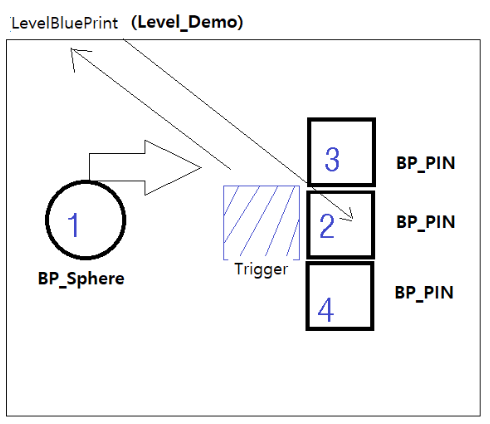

---
실행예시

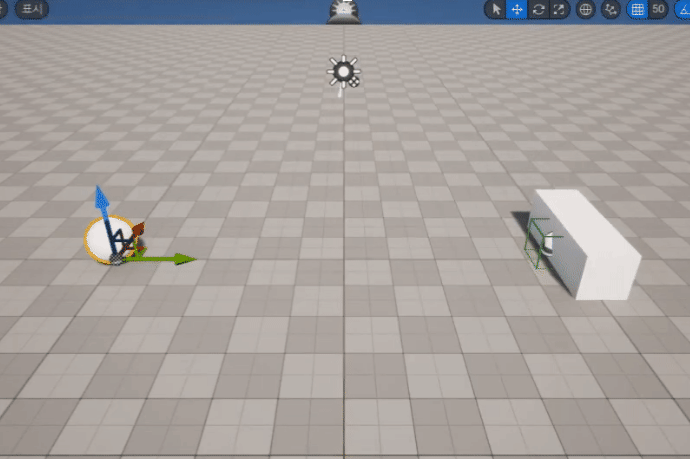

---
구현 스텝

1. 1번(BP_Sphere) 이동 -> Trigger 통신
    - TriggerBox 충돌 -> TriggerBox 이벤트 처리 -> 1번 멈춤

2. 레벨 블루프린트 -> 블루프린트 클래스 통신
    - 레벨 블루프린트 2번(BP_PIN)을 위로 이동

3. 블루프린트 클래스 -> 블루프린트 클래스 통신
    - 2번(BP_PIN)이 3번(BP_PIN), 4번(BP_PIN) 각각 좌우로 이동

4. 블루프린트 클래스 -> 레벨 블루프린트 통신
    - 2번(BP_PIN)이 높이 500이상 올라가면 레벨 블루프린트 통신

5. 레벨 블루프린트 -> 블루프린트 클래스 통신
    - 레벨 블루프린트가 1번 이동

---
BP_Sphere 오른쪽으로 이동, 이동 및 정지 커스텀 이벤트

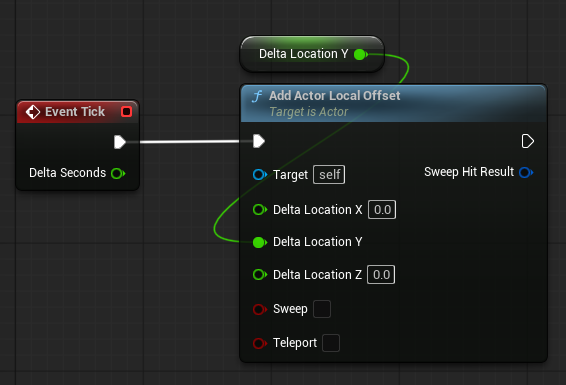

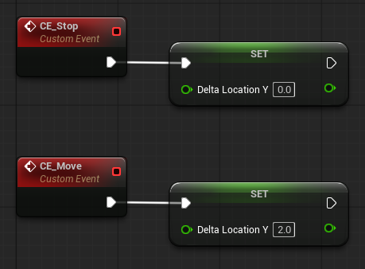

---
TriggerBox 이벤트, 2번(BP_PIN) 위로 이동, 3, 4번 좌우로 이동

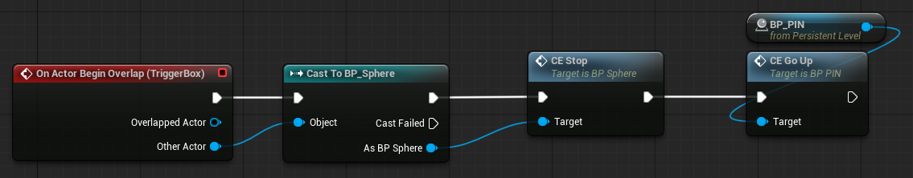

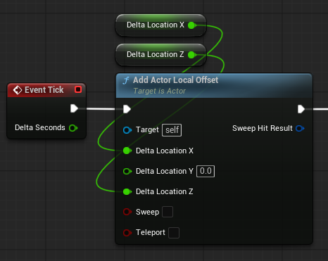

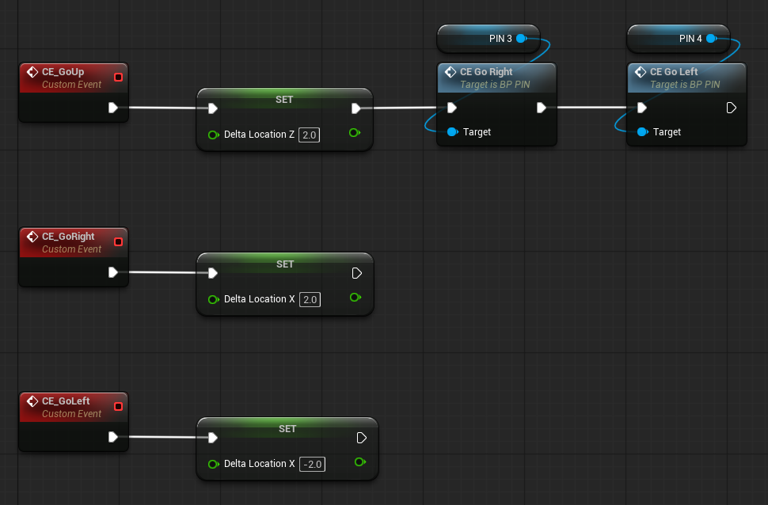

---
2번이 높이 500이상 올라가면 레벨 블루프린트와 통신, 1번 다시 이동

\
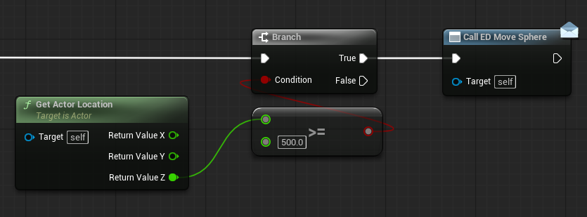

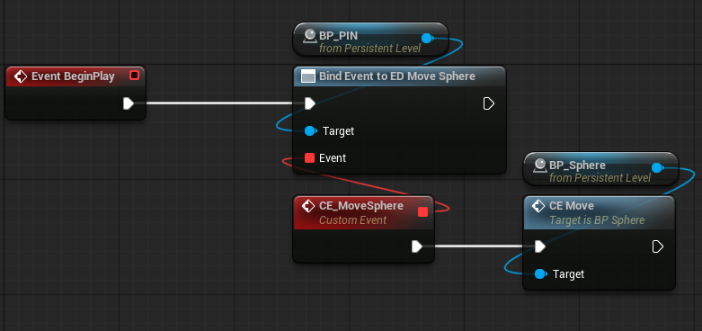
